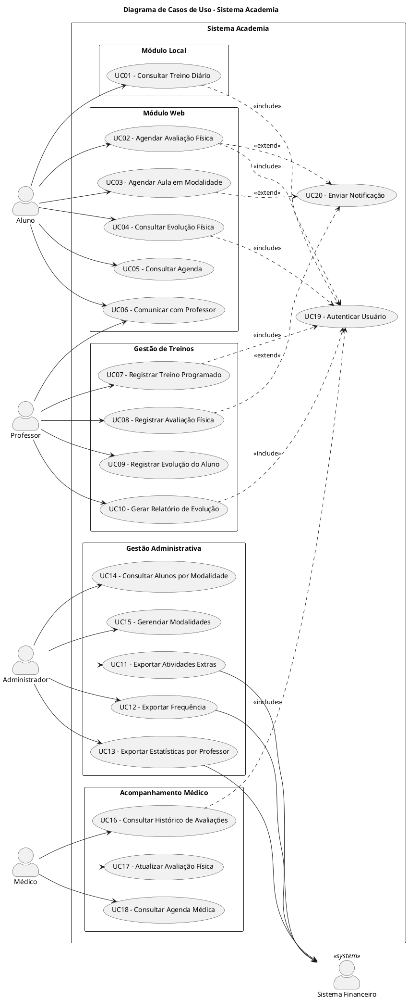

# Seção 1 – Diagrama de Casos de Uso

## 1.1 Introdução

O diagrama de casos de uso apresenta uma visão geral das funcionalidades do Sistema Academia, identificando os atores que interagem com o sistema e os principais casos de uso disponíveis. O sistema foi projetado para atender às necessidades de monitoramento e controle das atividades dos alunos de uma academia de grande porte.

## 1.2 Atores do Sistema

### 1.2.1 Atores Primários

| Ator | Descrição |
|------|-----------|
| **Aluno** | Usuário principal do sistema. Consulta treinos, agenda avaliações físicas e aulas, visualiza sua evolução e se comunica com o professor. Acessa o sistema tanto pelo módulo local (computadores na academia) quanto pelo módulo web (navegador/celular). |
| **Professor** | Responsável por registrar e acompanhar os treinos dos alunos. Alimenta dados de avaliações físicas e evolução, além de gerar relatórios de acompanhamento. |
| **Administrador** | Gerencia as operações administrativas da academia. Exporta dados para o sistema financeiro e controla modalidades e turmas oferecidas. |
| **Médico** | Profissional responsável pelo acompanhamento físico dos alunos. Consulta e atualiza avaliações físicas, além de gerenciar sua agenda de atendimentos. |

### 1.2.2 Atores Secundários

| Ator | Descrição |
|------|-----------|
| **Sistema Financeiro** | Sistema externo que recebe dados exportados para controle de cobranças e cálculo de comissões dos professores. |

## 1.3 Lista de Casos de Uso

### Módulo Local

| ID | Nome do Caso de Uso | Ator Principal |
|----|---------------------|----------------|
| UC01 | Consultar Treino Diário | Aluno |

### Módulo Web

| ID | Nome do Caso de Uso | Ator Principal |
|----|---------------------|----------------|
| UC02 | Agendar Avaliação Física | Aluno |
| UC03 | Agendar Aula em Modalidade | Aluno |
| UC04 | Consultar Evolução Física | Aluno |
| UC05 | Consultar Agenda | Aluno |
| UC06 | Comunicar com Professor | Aluno, Professor |

### Gestão de Treinos

| ID | Nome do Caso de Uso | Ator Principal |
|----|---------------------|----------------|
| UC07 | Registrar Treino Programado | Professor |
| UC08 | Registrar Avaliação Física | Professor |
| UC09 | Registrar Evolução do Aluno | Professor |
| UC10 | Gerar Relatório de Evolução | Professor |

### Gestão Administrativa

| ID | Nome do Caso de Uso | Ator Principal |
|----|---------------------|----------------|
| UC11 | Exportar Atividades Extras | Administrador |
| UC12 | Exportar Frequência | Administrador |
| UC13 | Exportar Estatísticas por Professor | Administrador |
| UC14 | Consultar Alunos por Modalidade | Administrador |
| UC15 | Gerenciar Modalidades | Administrador |

### Acompanhamento Médico

| ID | Nome do Caso de Uso | Ator Principal |
|----|---------------------|----------------|
| UC16 | Consultar Histórico de Avaliações | Médico |
| UC17 | Atualizar Avaliação Física | Médico |
| UC18 | Consultar Agenda Médica | Médico |

### Casos de Uso Auxiliares

| ID | Nome do Caso de Uso | Descrição |
|----|---------------------|-----------|
| UC19 | Autenticar Usuário | Caso de uso incluído por outros para validar credenciais |
| UC20 | Enviar Notificação | Caso de uso estendido para envio de alertas e confirmações |

## 1.4 Diagrama de Casos de Uso

## 1.5 Relacionamentos

### 1.5.1 Relacionamentos de Inclusão (<<include>>)

Os seguintes casos de uso incluem obrigatoriamente a autenticação do usuário:

- UC01 (Consultar Treino Diário) → UC19 (Autenticar Usuário)
- UC02 (Agendar Avaliação Física) → UC19 (Autenticar Usuário)
- UC04 (Consultar Evolução Física) → UC19 (Autenticar Usuário)
- UC07 (Registrar Treino Programado) → UC19 (Autenticar Usuário)
- UC10 (Gerar Relatório de Evolução) → UC19 (Autenticar Usuário)
- UC16 (Consultar Histórico de Avaliações) → UC19 (Autenticar Usuário)

### 1.5.2 Relacionamentos de Extensão (<<extend>>)

Os seguintes casos de uso podem opcionalmente enviar notificações:

- UC02 (Agendar Avaliação Física) ← UC20 (Enviar Notificação)
- UC03 (Agendar Aula em Modalidade) ← UC20 (Enviar Notificação)
- UC08 (Registrar Avaliação Física) ← UC20 (Enviar Notificação)

## 1.6 Requisitos de Acessibilidade

Conforme especificado pelo cliente, o sistema deve:

- Ser acessível via navegadores web comuns
- Funcionar em dispositivos móveis (celulares)
- Atender aos requisitos de acessibilidade para alunos portadores de necessidades especiais
