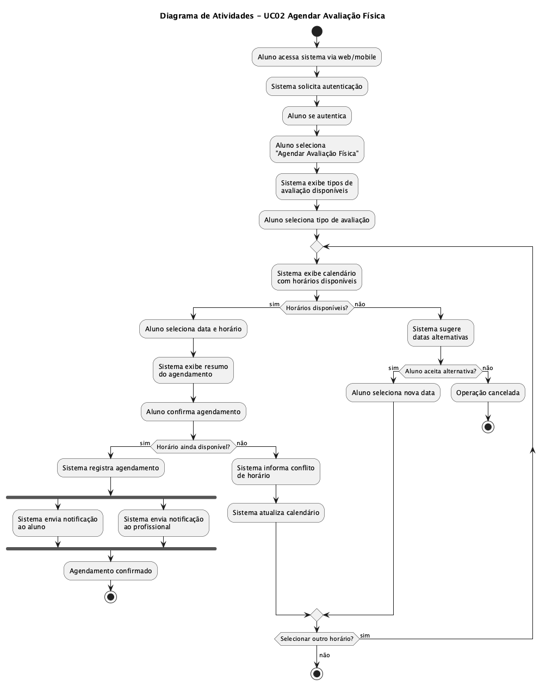
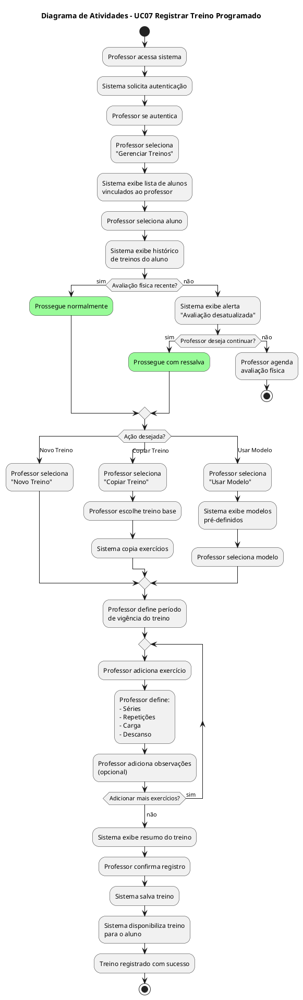
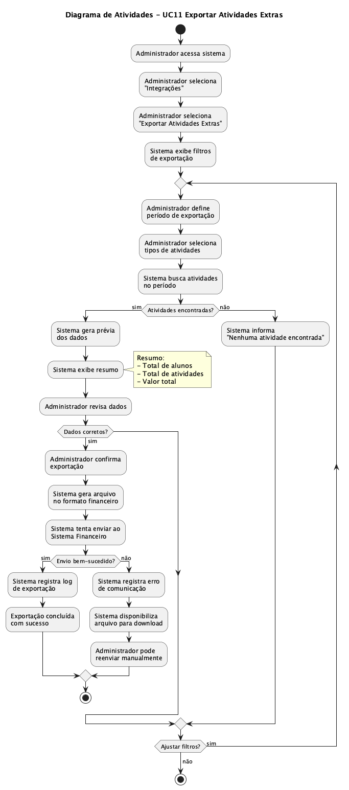
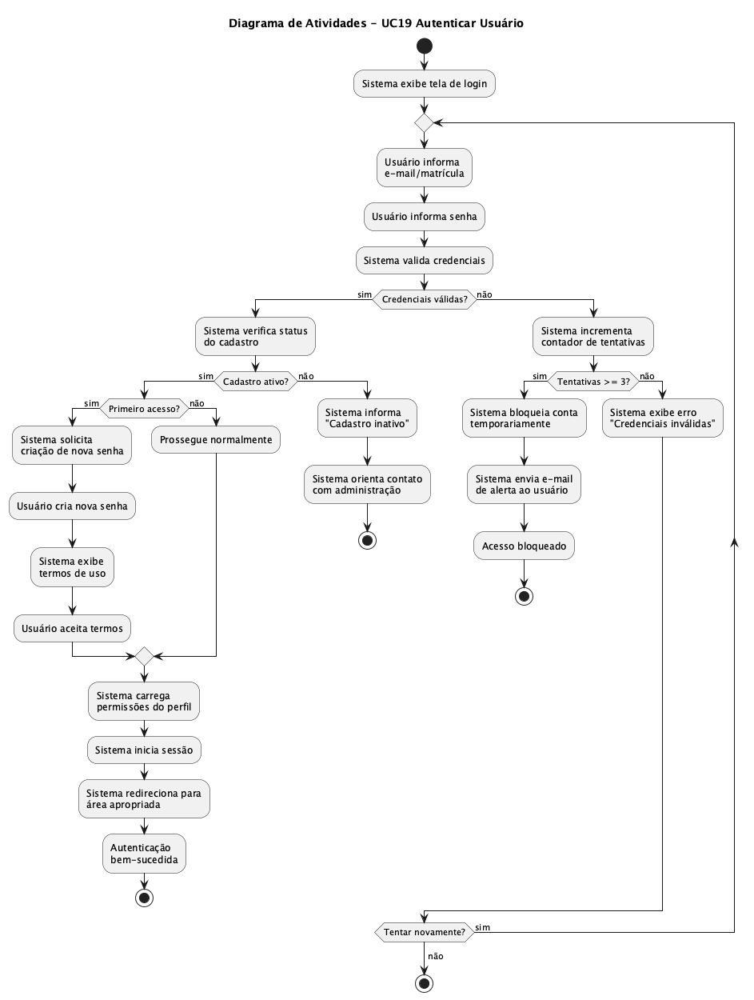

# Seção 3 – Diagramas de Atividades

## 3.1 Introdução

Os diagramas de atividades representam o fluxo de trabalho e as ações executadas em cada caso de uso do Sistema Academia. Eles ilustram a sequência de atividades, decisões e paralelismos que ocorrem durante a execução dos processos do sistema.

Foram elaborados diagramas de atividades para os casos de uso mais representativos de cada ator do sistema.

---

## 3.2 UC01 - Consultar Treino Diário

Este diagrama representa o fluxo de atividades quando o aluno consulta seu treino diário através do terminal na academia.


```plantuml
@startuml uc01-consultar-treino
title Diagrama de Atividades - UC01 Consultar Treino Diário

start

:Aluno acessa terminal na academia;

:Sistema solicita autenticação;

:Aluno fornece credenciais;

if (Credenciais válidas?) then (sim)
    :Sistema exibe menu principal;

    :Aluno seleciona "Consultar Treino Diário";

    :Sistema busca treino da data atual;

    if (Treino encontrado?) then (sim)
        :Sistema exibe lista de exercícios;

        note right
            Exibe:
            - Nome do exercício
            - Séries
            - Repetições
            - Carga
            - Observações
        end note

        :Aluno visualiza treino;

        :Sistema registra frequência;

    else (não)
        :Sistema exibe mensagem\n"Treino não cadastrado";

        :Sistema sugere contato\ncom professor;
    endif

else (não)
    :Sistema exibe erro de autenticação;

    if (Tentativas < 3?) then (sim)
        :Retorna para autenticação;
        backward:Aluno fornece credenciais;
    else (não)
        :Sistema bloqueia acesso temporariamente;
        stop
    endif
endif

stop

@enduml
```

### Descrição do Fluxo

1. O aluno inicia o processo acessando o terminal físico na academia
2. O sistema solicita e valida as credenciais do aluno
3. Após autenticação bem-sucedida, o aluno pode consultar seu treino do dia
4. O sistema busca e exibe os exercícios programados
5. A frequência do aluno é registrada automaticamente

---

## 3.3 UC02 - Agendar Avaliação Física

Este diagrama representa o fluxo para agendamento de avaliações físicas periódicas pelo aluno.



```plantuml
@startuml uc02-agendar-avaliacao
title Diagrama de Atividades - UC02 Agendar Avaliação Física

start

:Aluno acessa sistema via web/mobile;

:Sistema solicita autenticação;

:Aluno se autentica;

:Aluno seleciona\n"Agendar Avaliação Física";

:Sistema exibe tipos de\navaliação disponíveis;

:Aluno seleciona tipo de avaliação;

:Sistema exibe calendário\ncom horários disponíveis;

if (Horários disponíveis?) then (sim)

    :Aluno seleciona data e horário;

    :Sistema exibe resumo\ndo agendamento;

    :Aluno confirma agendamento;

    if (Horário ainda disponível?) then (sim)

        :Sistema registra agendamento;

        fork
            :Sistema envia notificação\nao aluno;
        fork again
            :Sistema envia notificação\nao profissional;
        end fork

        :Agendamento confirmado;

    else (não)
        :Sistema informa conflito\nde horário;

        :Retorna ao calendário;
        backward:Sistema exibe calendário\ncom horários disponíveis;
    endif

else (não)
    :Sistema sugere\ndatas alternativas;

    if (Aluno aceita alternativa?) then (sim)
        :Aluno seleciona nova data;
        backward:Sistema exibe calendário\ncom horários disponíveis;
    else (não)
        :Operação cancelada;
    endif
endif

stop

@enduml
```

### Descrição do Fluxo

1. O aluno acessa o sistema via navegador ou aplicativo móvel
2. Após autenticação, seleciona o tipo de avaliação desejada
3. O sistema exibe o calendário com horários disponíveis
4. O aluno seleciona data/horário e confirma
5. Notificações são enviadas em paralelo ao aluno e ao profissional

---

## 3.4 UC07 - Registrar Treino Programado

Este diagrama representa o fluxo de registro de treino personalizado pelo professor.




### Descrição do Fluxo

1. O professor acessa o sistema e seleciona o aluno
2. O sistema verifica se há avaliação física recente
3. O professor pode criar novo treino, copiar existente ou usar modelo
4. Exercícios são adicionados em loop até completar o treino
5. O treino é salvo e disponibilizado para o aluno

---

## 3.5 UC08 - Registrar Avaliação Física

Este diagrama representa o fluxo de registro de avaliação física pelo professor.


```plantuml
@startuml uc08-registrar-avaliacao
title Diagrama de Atividades - UC08 Registrar Avaliação Física

start

:Professor acessa sistema;

:Professor seleciona "Avaliações";

:Sistema exibe avaliações\nagendadas para hoje;

if (Avaliação na lista?) then (sim)
    :Professor seleciona\navaliação agendada;
else (não)
    :Professor seleciona\n"Nova Avaliação";

    :Professor busca aluno;

    :Professor seleciona aluno;
endif

:Sistema exibe formulário\nde avaliação;

partition "Medidas Corporais" {
    :Professor registra peso;
    :Professor registra altura;
    :Professor calcula IMC;
    :Professor registra\npercentual de gordura;
    :Professor registra\ncircunferências;

    note right
        Circunferências:
        - Braço
        - Peitoral
        - Cintura
        - Quadril
        - Coxa
        - Panturrilha
    end note
}

partition "Testes Físicos" {
    :Professor registra\nteste de flexibilidade;
    :Professor registra\nteste de resistência;
    :Professor registra\nteste de força;
}

:Professor adiciona\nobservações gerais;

if (Dados completos?) then (sim)
    :Professor confirma registro;

    :Sistema salva avaliação;

    :Sistema atualiza histórico\ndo aluno;

    fork
        :Sistema notifica aluno\nsobre nova avaliação;
    fork again
        :Sistema disponibiliza dados\npara médico;
    end fork

    :Avaliação registrada\ncom sucesso;

else (não)
    :Sistema indica campos\nobrigatórios faltantes;

    backward:Professor registra peso;
endif

stop

@enduml
```

### Descrição do Fluxo

1. O professor acessa avaliações agendadas ou cria nova avaliação
2. O formulário é dividido em partições: medidas corporais e testes físicos
3. Após preenchimento completo, a avaliação é salva
4. Notificações são enviadas em paralelo ao aluno e disponibilizadas ao médico

---

## 3.6 UC11 - Exportar Atividades Extras

Este diagrama representa o fluxo de exportação de atividades extras para o sistema financeiro.



```plantuml
@startuml uc11-exportar-atividades
title Diagrama de Atividades - UC11 Exportar Atividades Extras

start

:Administrador acessa sistema;

:Administrador seleciona\n"Integrações";

:Administrador seleciona\n"Exportar Atividades Extras";

:Sistema exibe filtros\nde exportação;

:Administrador define\nperíodo de exportação;

:Administrador seleciona\ntipos de atividades;

:Sistema busca atividades\nno período;

if (Atividades encontradas?) then (sim)

    :Sistema gera prévia\ndos dados;

    :Sistema exibe resumo:
    - Total de alunos
    - Total de atividades
    - Valor total;

    :Administrador revisa dados;

    if (Dados corretos?) then (sim)

        :Administrador confirma\nexportação;

        :Sistema gera arquivo\nno formato financeiro;

        :Sistema tenta enviar ao\nSistema Financeiro;

        if (Envio bem-sucedido?) then (sim)

            :Sistema registra log\nde exportação;

            :Exportação concluída\ncom sucesso;

        else (não)

            :Sistema registra erro\nde comunicação;

            :Sistema disponibiliza\narquivo para download;

            :Administrador pode\nreenviar manualmente;

        endif

    else (não)

        :Administrador ajusta\nfiltros;

        backward:Sistema busca atividades\nno período;

    endif

else (não)

    :Sistema informa\n"Nenhuma atividade encontrada";

    :Administrador pode\najustar período;

endif

stop

@enduml
```

### Descrição do Fluxo

1. O administrador acessa a área de integrações
2. Define filtros de período e tipos de atividades
3. O sistema gera prévia dos dados para revisão
4. Após confirmação, o arquivo é gerado e enviado ao Sistema Financeiro
5. Em caso de falha, o arquivo fica disponível para download manual

---

## 3.7 UC19 - Autenticar Usuário

Este diagrama representa o fluxo de autenticação comum a todos os usuários do sistema.



```plantuml
@startuml uc19-autenticar-usuario
title Diagrama de Atividades - UC19 Autenticar Usuário

start

:Sistema exibe tela de login;

:Usuário informa\ne-mail/matrícula;

:Usuário informa senha;

:Sistema valida credenciais;

if (Credenciais válidas?) then (sim)

    :Sistema verifica status\ndo cadastro;

    if (Cadastro ativo?) then (sim)

        if (Primeiro acesso?) then (sim)

            :Sistema solicita\ncriação de nova senha;

            :Usuário cria nova senha;

            :Sistema exibe\ntermos de uso;

            :Usuário aceita termos;

        else (não)
            #palegreen:Prossegue normalmente;
        endif

        :Sistema carrega\npermissões do perfil;

        :Sistema inicia sessão;

        :Sistema redireciona para\nárea apropriada;

        :Autenticação\nbem-sucedida;

    else (não)

        :Sistema informa\n"Cadastro inativo";

        :Sistema orienta contato\ncom administração;

        stop

    endif

else (não)

    :Sistema incrementa\ncontador de tentativas;

    if (Tentativas < 3?) then (sim)

        :Sistema exibe erro\n"Credenciais inválidas";

        backward:Usuário informa\ne-mail/matrícula;

    else (não)

        :Sistema bloqueia conta\ntemporariamente;

        :Sistema envia e-mail\nde alerta ao usuário;

        :Acesso bloqueado;

        stop

    endif

endif

stop

@enduml
```

### Descrição do Fluxo

1. O usuário informa suas credenciais na tela de login
2. O sistema valida credenciais e status do cadastro
3. No primeiro acesso, é solicitada criação de senha e aceite de termos
4. Após autenticação, as permissões são carregadas conforme o perfil
5. Após 3 tentativas inválidas, a conta é bloqueada temporariamente

---

## 3.8 Elementos Utilizados nos Diagramas

| Elemento | Símbolo | Descrição |
|----------|---------|-----------|
| **Início** | Círculo preenchido | Ponto de início do fluxo |
| **Fim** | Círculo com borda | Ponto de término do fluxo |
| **Atividade** | Retângulo arredondado | Ação executada no processo |
| **Decisão** | Losango | Ponto de ramificação condicional |
| **Fork/Join** | Barra horizontal | Início/fim de atividades paralelas |
| **Partição** | Área delimitada | Agrupamento lógico de atividades |
| **Nota** | Retângulo com dobra | Informação adicional |
| **Switch** | Losango múltiplo | Múltiplas opções de caminho |
| **Loop** | Seta de retorno | Repetição de atividades |
