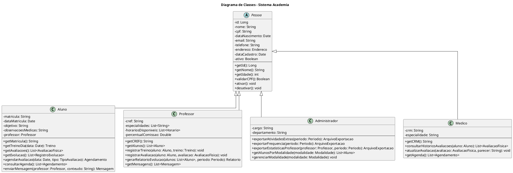

# Seção 4 – Diagrama de Classes

## 4.1 Introdução

O diagrama de classes representa a estrutura estática do Sistema Academia, identificando as classes, seus atributos, métodos e os relacionamentos entre elas. O modelo foi elaborado seguindo os princípios da orientação a objetos, incluindo herança, composição, agregação e associações.

## 4.2 Visão Geral da Arquitetura

O sistema está organizado nos seguintes pacotes conceituais:

| Pacote | Descrição |
|--------|-----------|
| **Pessoa** | Classes que representam os atores do sistema (Aluno, Professor, Administrador, Médico) |
| **Treino** | Classes relacionadas ao gerenciamento de treinos e exercícios |
| **Avaliação** | Classes para registro e acompanhamento de avaliações físicas |
| **Modalidade** | Classes de gerenciamento de modalidades e turmas |
| **Agendamento** | Classes de controle de agendamentos |
| **Comunicação** | Classes de mensagens e notificações |
| **Integração** | Classes para exportação e integração com sistema financeiro |

## 4.3 Diagrama de Classes




## 4.4 Descrição das Classes

### 4.4.1 Classes de Pessoa (Herança)

#### Pessoa (Abstrata)

Classe base abstrata que contém os atributos e métodos comuns a todas as pessoas do sistema.

| Atributo | Tipo | Descrição |
|----------|------|-----------|
| id | Long | Identificador único |
| nome | String | Nome completo |
| cpf | String | CPF (validado) |
| dataNascimento | Date | Data de nascimento |
| email | String | E-mail para contato |
| telefone | String | Telefone para contato |
| endereco | Endereco | Endereço completo |
| dataCadastro | Date | Data de cadastro no sistema |
| ativo | Boolean | Status ativo/inativo |

| Método | Retorno | Descrição |
|--------|---------|-----------|
| getId() | Long | Retorna o identificador |
| getNome() | String | Retorna o nome |
| getIdade() | int | Calcula a idade atual |
| validarCPF() | Boolean | Valida o CPF |
| ativar() | void | Ativa o cadastro |
| desativar() | void | Desativa o cadastro |

---

#### Aluno

Representa o aluno matriculado na academia. Herda de Pessoa.

| Atributo | Tipo | Descrição |
|----------|------|-----------|
| matricula | String | Número de matrícula único |
| dataMatricula | Date | Data da matrícula |
| objetivo | String | Objetivo do aluno (emagrecimento, hipertrofia, etc.) |
| observacoesMedicas | String | Observações médicas relevantes |
| professor | Professor | Professor responsável |

| Método | Retorno | Descrição |
|--------|---------|-----------|
| getMatricula() | String | Retorna a matrícula |
| getTreinoDia(data) | Treino | Retorna treino do dia |
| getAvaliacoes() | List\<AvaliacaoFisica\> | Lista avaliações |
| getEvolucao() | List\<RegistroEvolucao\> | Lista registros de evolução |
| agendarAvaliacao(data, tipo) | Agendamento | Agenda avaliação física |
| consultarAgenda() | List\<Agendamento\> | Lista agendamentos |
| enviarMensagem(professor, conteudo) | Mensagem | Envia mensagem ao professor |

---

#### Professor

Representa o professor/instrutor da academia. Herda de Pessoa.

| Atributo | Tipo | Descrição |
|----------|------|-----------|
| cref | String | Registro no CREF |
| especialidades | List\<String\> | Lista de especialidades |
| horariosDisponiveis | List\<Horario\> | Horários de disponibilidade |
| percentualComissao | Double | Percentual de comissão |

| Método | Retorno | Descrição |
|--------|---------|-----------|
| getCREF() | String | Retorna o CREF |
| getAlunos() | List\<Aluno\> | Lista alunos vinculados |
| registrarTreino(aluno, treino) | void | Registra treino para aluno |
| registrarAvaliacao(aluno, avaliacao) | void | Registra avaliação |
| gerarRelatorioEvolucao(alunos, periodo) | Relatorio | Gera relatório |
| getMensagens() | List\<Mensagem\> | Lista mensagens |

---

#### Administrador

Representa o administrador da academia. Herda de Pessoa.

| Atributo | Tipo | Descrição |
|----------|------|-----------|
| cargo | String | Cargo na academia |
| departamento | String | Departamento |

| Método | Retorno | Descrição |
|--------|---------|-----------|
| exportarAtividadesExtras(periodo) | ArquivoExportacao | Exporta atividades extras |
| exportarFrequencia(periodo) | ArquivoExportacao | Exporta frequência |
| exportarEstatisticasProfessor(professor, periodo) | ArquivoExportacao | Exporta estatísticas |
| getAlunosPorModalidade(modalidade) | List\<Aluno\> | Lista alunos por modalidade |
| gerenciarModalidade(modalidade) | void | Gerencia modalidade |

---

#### Medico

Representa o médico responsável pelo acompanhamento físico. Herda de Pessoa.

| Atributo | Tipo | Descrição |
|----------|------|-----------|
| crm | String | Registro no CRM |
| especialidade | String | Especialidade médica |

| Método | Retorno | Descrição |
|--------|---------|-----------|
| getCRM() | String | Retorna o CRM |
| consultarHistoricoAvaliacoes(aluno) | List\<AvaliacaoFisica\> | Consulta histórico |
| atualizarAvaliacao(avaliacao, parecer) | void | Adiciona parecer médico |
| getAgenda() | List\<Agendamento\> | Lista agenda |

---

### 4.4.2 Classes de Treino

#### Treino

Representa o programa de treino de um aluno.

| Atributo | Tipo | Descrição |
|----------|------|-----------|
| id | Long | Identificador único |
| aluno | Aluno | Aluno proprietário do treino |
| professor | Professor | Professor que elaborou |
| dataInicio | Date | Início da vigência |
| dataFim | Date | Fim da vigência |
| objetivo | String | Objetivo do treino |
| observacoes | String | Observações gerais |
| exercicios | List\<ExercicioTreino\> | Lista de exercícios |
| ativo | Boolean | Status do treino |

| Método | Retorno | Descrição |
|--------|---------|-----------|
| getExercicios() | List\<ExercicioTreino\> | Lista exercícios |
| adicionarExercicio(exercicio) | void | Adiciona exercício |
| removerExercicio(exercicio) | void | Remove exercício |
| clonar() | Treino | Clona o treino |
| estaVigente() | Boolean | Verifica se está vigente |

---

#### Exercicio

Representa um exercício físico cadastrado no sistema.

| Atributo | Tipo | Descrição |
|----------|------|-----------|
| id | Long | Identificador único |
| nome | String | Nome do exercício |
| descricao | String | Descrição detalhada |
| grupoMuscular | GrupoMuscular | Grupo muscular trabalhado |
| equipamento | String | Equipamento utilizado |
| videoUrl | String | URL de vídeo demonstrativo |

---

#### ExercicioTreino

Representa a associação entre um treino e um exercício, com suas configurações específicas.

| Atributo | Tipo | Descrição |
|----------|------|-----------|
| id | Long | Identificador único |
| exercicio | Exercicio | Exercício referenciado |
| series | int | Número de séries |
| repeticoes | int | Número de repetições |
| carga | Double | Carga em kg |
| descanso | int | Tempo de descanso em segundos |
| ordem | int | Ordem no treino |
| observacoes | String | Observações específicas |

---

### 4.4.3 Classes de Avaliação

#### AvaliacaoFisica

Representa uma avaliação física realizada com o aluno.

| Atributo | Tipo | Descrição |
|----------|------|-----------|
| id | Long | Identificador único |
| aluno | Aluno | Aluno avaliado |
| professor | Professor | Professor avaliador |
| medico | Medico | Médico (opcional) |
| data | Date | Data da avaliação |
| tipo | TipoAvaliacao | Tipo da avaliação |
| medidasCorporais | MedidasCorporais | Medidas corporais |
| testesFisicos | TestesFisicos | Resultados dos testes |
| observacoes | String | Observações |
| parecerMedico | String | Parecer do médico |

| Método | Retorno | Descrição |
|--------|---------|-----------|
| getIMC() | Double | Calcula o IMC |
| getPercentualGordura() | Double | Retorna % de gordura |
| compararCom(outra) | ComparacaoAvaliacao | Compara avaliações |
| adicionarParecerMedico(parecer) | void | Adiciona parecer |

---

#### MedidasCorporais

Classe de composição que agrupa as medidas corporais.

| Atributo | Tipo | Descrição |
|----------|------|-----------|
| peso | Double | Peso em kg |
| altura | Double | Altura em metros |
| percentualGordura | Double | Percentual de gordura |
| circunferenciaBraco | Double | Circunferência do braço |
| circunferenciaPeitoral | Double | Circunferência peitoral |
| circunferenciaCintura | Double | Circunferência da cintura |
| circunferenciaQuadril | Double | Circunferência do quadril |
| circunferenciaCoxa | Double | Circunferência da coxa |
| circunferenciaPanturrilha | Double | Circunferência da panturrilha |

| Método | Retorno | Descrição |
|--------|---------|-----------|
| calcularIMC() | Double | Calcula o IMC |
| calcularRCQ() | Double | Calcula relação cintura-quadril |

---

#### TestesFisicos

Classe de composição que agrupa os resultados dos testes físicos.

| Atributo | Tipo | Descrição |
|----------|------|-----------|
| flexibilidade | Double | Resultado do teste de flexibilidade |
| resistenciaCardiaca | int | Batimentos por minuto |
| forcaSuperiores | Double | Força membros superiores |
| forcaInferiores | Double | Força membros inferiores |
| equilibrio | int | Tempo de equilíbrio em segundos |

---

#### RegistroEvolucao

Representa um registro de evolução do aluno.

| Atributo | Tipo | Descrição |
|----------|------|-----------|
| id | Long | Identificador único |
| aluno | Aluno | Aluno |
| professor | Professor | Professor responsável |
| data | Date | Data do registro |
| tipoEvolucao | String | Tipo (força, resistência, etc.) |
| descricao | String | Descrição detalhada |
| metricas | Map\<String, Double\> | Métricas quantitativas |
| fotos | List\<String\> | URLs das fotos |

---

### 4.4.4 Classes de Modalidade

#### Modalidade

Representa uma modalidade oferecida pela academia.

| Atributo | Tipo | Descrição |
|----------|------|-----------|
| id | Long | Identificador único |
| nome | String | Nome da modalidade |
| descricao | String | Descrição |
| capacidadeMaxima | int | Capacidade máxima |
| valorAdicional | Double | Valor adicional (se houver) |
| ativa | Boolean | Status ativa/inativa |
| turmas | List\<Turma\> | Turmas da modalidade |

| Método | Retorno | Descrição |
|--------|---------|-----------|
| getTurmas() | List\<Turma\> | Lista turmas |
| getTotalAlunos() | int | Total de alunos |
| adicionarTurma(turma) | void | Adiciona turma |

---

#### Turma

Representa uma turma de uma modalidade.

| Atributo | Tipo | Descrição |
|----------|------|-----------|
| id | Long | Identificador único |
| modalidade | Modalidade | Modalidade |
| professor | Professor | Professor responsável |
| horario | Horario | Horário da turma |
| capacidade | int | Capacidade da turma |
| alunos | List\<Aluno\> | Alunos matriculados |
| ativa | Boolean | Status |

| Método | Retorno | Descrição |
|--------|---------|-----------|
| getVagasDisponiveis() | int | Vagas disponíveis |
| adicionarAluno(aluno) | Boolean | Adiciona aluno |
| removerAluno(aluno) | void | Remove aluno |
| estaLotada() | Boolean | Verifica se está lotada |

---

#### Horario

Representa um horário no sistema.

| Atributo | Tipo | Descrição |
|----------|------|-----------|
| id | Long | Identificador único |
| diaSemana | DiaSemana | Dia da semana |
| horaInicio | Time | Hora de início |
| horaFim | Time | Hora de término |

| Método | Retorno | Descrição |
|--------|---------|-----------|
| getDuracao() | int | Duração em minutos |
| conflitaCom(outro) | Boolean | Verifica conflito |

---

### 4.4.5 Classes de Agendamento

#### Agendamento

Representa um agendamento no sistema.

| Atributo | Tipo | Descrição |
|----------|------|-----------|
| id | Long | Identificador único |
| aluno | Aluno | Aluno |
| tipo | TipoAgendamento | Tipo do agendamento |
| data | Date | Data |
| horario | Horario | Horário |
| status | StatusAgendamento | Status |
| observacoes | String | Observações |

| Método | Retorno | Descrição |
|--------|---------|-----------|
| confirmar() | void | Confirma agendamento |
| cancelar() | void | Cancela agendamento |
| reagendar(novaData, novoHorario) | void | Reagenda |

---

### 4.4.6 Classes de Comunicação

#### Mensagem

Representa uma mensagem entre usuários.

| Atributo | Tipo | Descrição |
|----------|------|-----------|
| id | Long | Identificador único |
| remetente | Pessoa | Remetente |
| destinatario | Pessoa | Destinatário |
| conteudo | String | Conteúdo da mensagem |
| dataEnvio | DateTime | Data e hora do envio |
| lida | Boolean | Flag de leitura |
| anexos | List\<String\> | URLs dos anexos |

---

#### Notificacao

Representa uma notificação do sistema.

| Atributo | Tipo | Descrição |
|----------|------|-----------|
| id | Long | Identificador único |
| destinatario | Pessoa | Destinatário |
| tipo | TipoNotificacao | Tipo da notificação |
| titulo | String | Título |
| mensagem | String | Mensagem |
| dataEnvio | DateTime | Data e hora |
| lida | Boolean | Flag de leitura |
| canal | CanalNotificacao | Canal de envio |

---

### 4.4.7 Classes de Integração

#### AtividadeExtra

Representa uma atividade extra cobrada separadamente.

| Atributo | Tipo | Descrição |
|----------|------|-----------|
| id | Long | Identificador único |
| aluno | Aluno | Aluno |
| descricao | String | Descrição |
| data | Date | Data da atividade |
| valor | Double | Valor cobrado |
| exportada | Boolean | Flag de exportação |

---

#### RegistroFrequencia

Representa um registro de frequência do aluno.

| Atributo | Tipo | Descrição |
|----------|------|-----------|
| id | Long | Identificador único |
| aluno | Aluno | Aluno |
| dataEntrada | DateTime | Data e hora de entrada |
| dataSaida | DateTime | Data e hora de saída |

---

#### ArquivoExportacao

Representa um arquivo de exportação para o sistema financeiro.

| Atributo | Tipo | Descrição |
|----------|------|-----------|
| id | Long | Identificador único |
| tipo | TipoExportacao | Tipo de exportação |
| dataGeracao | DateTime | Data de geração |
| periodo | Periodo | Período de referência |
| conteudo | byte[] | Conteúdo do arquivo |
| status | StatusExportacao | Status da exportação |

| Método | Retorno | Descrição |
|--------|---------|-----------|
| gerar() | void | Gera o arquivo |
| enviar() | Boolean | Envia ao sistema externo |
| download() | byte[] | Retorna conteúdo para download |

---

## 4.5 Enumerações

### GrupoMuscular
```
PEITO, COSTAS, OMBROS, BICEPS, TRICEPS, ANTEBRACO,
ABDOMEN, QUADRICEPS, POSTERIOR, GLUTEOS, PANTURRILHA, CARDIO
```

### DiaSemana
```
SEGUNDA, TERCA, QUARTA, QUINTA, SEXTA, SABADO, DOMINGO
```

### TipoAvaliacao
```
INICIAL, PERIODICA, REAVALIACAO, ALTA
```

### TipoAgendamento
```
AVALIACAO_FISICA, AULA_MODALIDADE, CONSULTA_MEDICA
```

### StatusAgendamento
```
PENDENTE, CONFIRMADO, CANCELADO, REALIZADO
```

### TipoNotificacao
```
AGENDAMENTO_CONFIRMADO, AGENDAMENTO_CANCELADO, NOVO_TREINO,
AVALIACAO_DISPONIVEL, MENSAGEM_RECEBIDA
```

### CanalNotificacao
```
EMAIL, PUSH, SMS
```

### TipoExportacao
```
ATIVIDADES_EXTRAS, FREQUENCIA, ESTATISTICAS_PROFESSOR
```

### StatusExportacao
```
GERADO, ENVIADO, ERRO
```

### Perfil
```
ALUNO, PROFESSOR, ADMINISTRADOR, MEDICO
```

---

## 4.6 Relacionamentos

### 4.6.1 Herança

| Classe Pai | Classes Filhas |
|------------|----------------|
| Pessoa (abstrata) | Aluno, Professor, Administrador, Medico |

### 4.6.2 Composição (parte essencial)

| Classe Todo | Classe Parte | Descrição |
|-------------|--------------|-----------|
| Pessoa | Endereco | Pessoa possui um endereço |
| Treino | ExercicioTreino | Treino contém exercícios |
| AvaliacaoFisica | MedidasCorporais | Avaliação contém medidas |
| AvaliacaoFisica | TestesFisicos | Avaliação contém testes |
| Modalidade | Turma | Modalidade possui turmas |

### 4.6.3 Agregação

| Classe Todo | Classe Parte | Descrição |
|-------------|--------------|-----------|
| ExercicioTreino | Exercicio | ExercicioTreino referencia Exercicio |
| Turma | Aluno | Turma agrega alunos |

### 4.6.4 Associações

| Classe Origem | Classe Destino | Cardinalidade | Descrição |
|---------------|----------------|---------------|-----------|
| Aluno | Professor | N:1 | Aluno é acompanhado por professor |
| Aluno | Treino | 1:N | Aluno possui treinos |
| Professor | Treino | 1:N | Professor elabora treinos |
| Aluno | AvaliacaoFisica | 1:N | Aluno realiza avaliações |
| Professor | Turma | 1:N | Professor leciona turmas |
| Pessoa | Usuario | 1:0..1 | Pessoa tem conta de usuário |
| Mensagem | Pessoa | N:1 | Mensagem envia/recebe pessoa |
