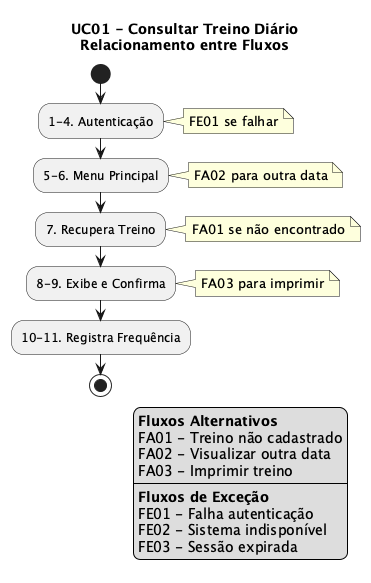

# Seção 2 – Especificação de Caso de Uso

## 2.1 Introdução

Esta seção apresenta a especificação detalhada do caso de uso principal do ator **Aluno** no Sistema Academia. O caso de uso selecionado é o **UC01 - Consultar Treino Diário**, que representa a funcionalidade central utilizada pelo aluno para acessar seu programa de treinamento personalizado.

A especificação inclui pré-condições, fluxo principal, fluxos alternativos, fluxos de exceção e pós-condições, demonstrando as relações entre os diferentes fluxos.

---

## 2.2 UC01 - Consultar Treino Diário

### Informações Gerais

| Campo | Descrição |
|-------|-----------|
| **Identificador** | UC01 |
| **Nome** | Consultar Treino Diário |
| **Ator Principal** | Aluno |
| **Atores Secundários** | - |
| **Descrição** | Permite ao aluno consultar seu treino programado para o dia atual através dos computadores localizados na academia, proporcionando agilidade e independência na execução dos exercícios. |
| **Prioridade** | Alta |
| **Frequência de Uso** | Diária |

---

### Pré-condições

| ID | Pré-condição |
|----|--------------|
| PRE01 | O aluno deve possuir cadastro ativo no sistema |
| PRE02 | O aluno deve estar autenticado no sistema |
| PRE03 | O aluno deve ter um treino cadastrado pelo professor para a data atual |
| PRE04 | O terminal de consulta na academia deve estar operacional |

---

### Pós-condições

| ID | Pós-condição |
|----|--------------|
| POS01 | O treino diário é exibido para o aluno com todos os exercícios, séries, repetições e cargas |
| POS02 | Um registro de consulta é armazenado no sistema para controle de frequência |
| POS03 | A data e hora da consulta são registradas no histórico do aluno |

---

### Fluxo Principal (FP)

| Passo | Ator | Sistema |
|-------|------|---------|
| 1 | O aluno acessa o terminal na academia | - |
| 2 | - | O sistema exibe a tela de login e solicita autenticação |
| 3 | O aluno informa sua matrícula e senha | - |
| 4 | - | O sistema valida as credenciais do aluno |
| 5 | - | O sistema exibe o menu principal com as opções disponíveis |
| 6 | O aluno seleciona a opção "Consultar Treino Diário" | - |
| 7 | - | O sistema recupera o treino programado para a data atual |
| 8 | - | O sistema exibe a lista de exercícios contendo: nome do exercício, número de séries, número de repetições, carga (peso), tempo de descanso e observações do professor |
| 9 | O aluno visualiza o treino e confirma a consulta | - |
| 10 | - | O sistema registra a frequência do aluno com data e hora |
| 11 | - | O sistema exibe mensagem de confirmação e retorna ao menu principal |

---

### Fluxos Alternativos

#### FA01 - Treino não cadastrado para a data atual

**Condição de ativação:** No passo 7 do fluxo principal, o sistema não encontra treino cadastrado para a data atual.

| Passo | Ator | Sistema |
|-------|------|---------|
| 7a.1 | - | O sistema identifica que não há treino cadastrado para a data |
| 7a.2 | - | O sistema exibe mensagem: "Não há treino programado para hoje" |
| 7a.3 | - | O sistema sugere que o aluno entre em contato com seu professor |
| 7a.4 | - | O sistema oferece opção de visualizar o último treino disponível |
| 7a.5 | O aluno pode selecionar visualizar último treino ou retornar ao menu | - |
| 7a.6 | - | Se o aluno optar por visualizar, retorna ao passo 8 do FP com o último treino; caso contrário, retorna ao passo 5 do FP |

---

#### FA02 - Visualizar treino de outra data

**Condição de ativação:** No passo 6 do fluxo principal, o aluno deseja consultar treino de uma data diferente da atual.

| Passo | Ator | Sistema |
|-------|------|---------|
| 6a.1 | O aluno seleciona a opção "Consultar Treino por Data" | - |
| 6a.2 | - | O sistema exibe um calendário para seleção de data |
| 6a.3 | O aluno seleciona a data desejada | - |
| 6a.4 | - | O sistema valida se existe treino para a data selecionada |
| 6a.5 | - | Retorna ao passo 7 do FP com a data selecionada |

---

#### FA03 - Imprimir treino

**Condição de ativação:** No passo 9 do fluxo principal, o aluno deseja imprimir seu treino.

| Passo | Ator | Sistema |
|-------|------|---------|
| 9a.1 | O aluno seleciona a opção "Imprimir Treino" | - |
| 9a.2 | - | O sistema formata o treino para impressão |
| 9a.3 | - | O sistema envia o documento para a impressora do terminal |
| 9a.4 | - | O sistema exibe mensagem de confirmação de impressão |
| 9a.5 | - | Retorna ao passo 10 do FP |

---

### Fluxos de Exceção

#### FE01 - Falha de autenticação

**Condição de ativação:** No passo 4 do fluxo principal, as credenciais informadas são inválidas.

| Passo | Ator | Sistema |
|-------|------|---------|
| 4a.1 | - | O sistema identifica que as credenciais são inválidas |
| 4a.2 | - | O sistema incrementa o contador de tentativas |
| 4a.3 | - | O sistema exibe mensagem: "Matrícula ou senha incorretos" |
| 4a.4 | - | Se tentativas < 3: retorna ao passo 2 do FP |
| 4a.5 | - | Se tentativas >= 3: o sistema bloqueia o acesso temporariamente por 15 minutos e exibe mensagem informando o bloqueio |
| 4a.6 | - | O caso de uso é encerrado |

---

#### FE02 - Sistema indisponível

**Condição de ativação:** Em qualquer passo, o sistema fica indisponível ou ocorre erro de conexão.

| Passo | Ator | Sistema |
|-------|------|---------|
| Xa.1 | - | O sistema detecta falha de conexão ou indisponibilidade |
| Xa.2 | - | O sistema exibe mensagem: "Sistema temporariamente indisponível. Por favor, tente novamente em alguns minutos." |
| Xa.3 | - | O sistema registra o erro no log para análise técnica |
| Xa.4 | - | O caso de uso é encerrado |

---

#### FE03 - Sessão expirada

**Condição de ativação:** Durante a execução, a sessão do usuário expira por inatividade.

| Passo | Ator | Sistema |
|-------|------|---------|
| Xa.1 | - | O sistema detecta que a sessão expirou (tempo limite: 10 minutos) |
| Xa.2 | - | O sistema exibe mensagem: "Sua sessão expirou por inatividade" |
| Xa.3 | - | Retorna ao passo 2 do FP para nova autenticação |

---

### Regras de Negócio

| ID | Regra |
|----|-------|
| RN01 | O treino exibido deve corresponder ao período de vigência definido pelo professor |
| RN02 | A frequência do aluno só é registrada após a confirmação da consulta (passo 9) |
| RN03 | O bloqueio por tentativas de login é temporário (15 minutos) |
| RN04 | A sessão do terminal expira após 10 minutos de inatividade |
| RN05 | Apenas treinos com status "Ativo" são exibidos para consulta |

---

### Requisitos Não Funcionais

| ID | Requisito |
|----|-----------|
| RNF01 | O tempo de resposta para exibição do treino não deve exceder 3 segundos |
| RNF02 | A interface deve ser acessível para portadores de necessidades especiais |
| RNF03 | O sistema deve suportar consultas simultâneas de múltiplos terminais |
| RNF04 | Os dados de autenticação devem ser transmitidos de forma criptografada |

---

### Diagrama de Relacionamento entre Fluxos

**Legenda de Cores:**
| Cor | Fluxo |
|-----|-------|
| Azul claro | Fluxo Principal |
| Amarelo | FA01 - Treino não cadastrado |
| Verde | FA02 - Visualizar outra data |
| Azul | FA03 - Imprimir treino |
| Vermelho | FE01 - Falha autenticação |

**Exceções Transversais:** FE02 - Sistema indisponível | FE03 - Sessão expirada (10 min)

---

### Observações

1. Este caso de uso está diretamente relacionado à história de usuário: *"Como aluno, quero ser capaz de consultar meus treinos diários, porque, assim, posso ter agilidade e independência na hora da execução."*

2. O caso de uso inclui implicitamente a autenticação (UC19 - Autenticar Usuário) nos passos 2 a 4.

3. O registro de frequência (passo 10) é utilizado posteriormente pelo administrador para exportação ao sistema financeiro (UC12 - Exportar Frequência).
