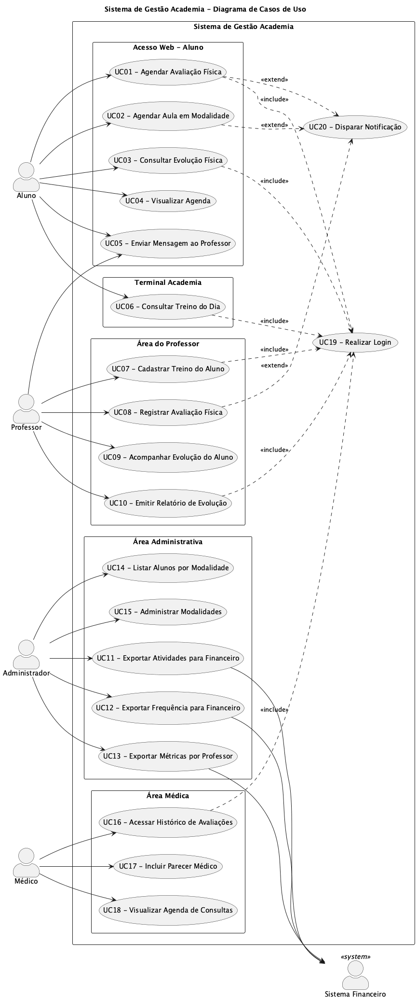

# Seção 1 – Diagrama de Casos de Uso

## 1.1 Introdução

Este documento apresenta o diagrama de casos de uso do Sistema de Gestão Academia, uma solução desenvolvida para monitoramento e controle das atividades dos alunos. O diagrama identifica os atores que interagem com o sistema, os casos de uso disponíveis e seus relacionamentos.

O sistema foi projetado para atender uma academia de grande porte com aproximadamente 2.000 alunos matriculados.

## 1.2 Atores do Sistema

### 1.2.1 Atores Primários

| Ator | Descrição |
|------|-----------|
| **Aluno** | Cliente da academia que utiliza o sistema para agendar avaliações, consultar treinos, visualizar evolução física e se comunicar com seu professor. Pode acessar via terminal local ou módulo web. |
| **Professor** | Profissional responsável pelo acompanhamento dos alunos. Cadastra treinos, registra avaliações e gera relatórios de evolução. |
| **Administrador** | Gestor responsável pelas operações administrativas. Realiza exportações para o sistema financeiro e gerencia modalidades oferecidas. |
| **Médico** | Profissional de saúde que acompanha a condição física dos alunos. Consulta histórico e adiciona pareceres médicos às avaliações. |

### 1.2.2 Atores Secundários

| Ator | Descrição |
|------|-----------|
| **Sistema Financeiro** | Sistema externo que recebe dados exportados para processamento de cobranças e cálculo de comissões. |

## 1.3 Lista de Casos de Uso

### Acesso Web - Aluno

| ID | Caso de Uso | Ator Principal |
|----|-------------|----------------|
| UC01 | Agendar Avaliação Física | Aluno |
| UC02 | Agendar Aula em Modalidade | Aluno |
| UC03 | Consultar Evolução Física | Aluno |
| UC04 | Visualizar Agenda | Aluno |
| UC05 | Enviar Mensagem ao Professor | Aluno, Professor |

### Terminal Academia

| ID | Caso de Uso | Ator Principal |
|----|-------------|----------------|
| UC06 | Consultar Treino do Dia | Aluno |

### Área do Professor

| ID | Caso de Uso | Ator Principal |
|----|-------------|----------------|
| UC07 | Cadastrar Treino do Aluno | Professor |
| UC08 | Registrar Avaliação Física | Professor |
| UC09 | Acompanhar Evolução do Aluno | Professor |
| UC10 | Emitir Relatório de Evolução | Professor |

### Área Administrativa

| ID | Caso de Uso | Ator Principal |
|----|-------------|----------------|
| UC11 | Exportar Atividades para Financeiro | Administrador |
| UC12 | Exportar Frequência para Financeiro | Administrador |
| UC13 | Exportar Métricas por Professor | Administrador |
| UC14 | Listar Alunos por Modalidade | Administrador |
| UC15 | Administrar Modalidades | Administrador |

### Área Médica

| ID | Caso de Uso | Ator Principal |
|----|-------------|----------------|
| UC16 | Acessar Histórico de Avaliações | Médico |
| UC17 | Incluir Parecer Médico | Médico |
| UC18 | Visualizar Agenda de Consultas | Médico |

### Casos de Uso de Suporte

| ID | Caso de Uso | Descrição |
|----|-------------|-----------|
| UC19 | Realizar Login | Autenticação obrigatória para acesso ao sistema |
| UC20 | Disparar Notificação | Envio de alertas e confirmações aos usuários |

## 1.4 Diagrama de Casos de Uso

## 1.5 Relacionamentos

### 1.5.1 Relacionamentos de Inclusão (<<include>>)

Os casos de uso abaixo requerem autenticação prévia do usuário:

- UC01 (Agendar Avaliação Física) → UC19 (Realizar Login)
- UC03 (Consultar Evolução Física) → UC19 (Realizar Login)
- UC06 (Consultar Treino do Dia) → UC19 (Realizar Login)
- UC07 (Cadastrar Treino do Aluno) → UC19 (Realizar Login)
- UC10 (Emitir Relatório de Evolução) → UC19 (Realizar Login)
- UC16 (Acessar Histórico de Avaliações) → UC19 (Realizar Login)

### 1.5.2 Relacionamentos de Extensão (<<extend>>)

Os casos de uso abaixo podem disparar notificações opcionalmente:

- UC01 (Agendar Avaliação Física) ← UC20 (Disparar Notificação)
- UC02 (Agendar Aula em Modalidade) ← UC20 (Disparar Notificação)
- UC08 (Registrar Avaliação Física) ← UC20 (Disparar Notificação)

## 1.6 Requisitos de Acessibilidade

O sistema deve atender aos seguintes requisitos:

- Compatibilidade com principais navegadores web
- Responsividade para acesso via dispositivos móveis
- Acessibilidade para usuários com necessidades especiais
- Interface intuitiva nos terminais da academia
