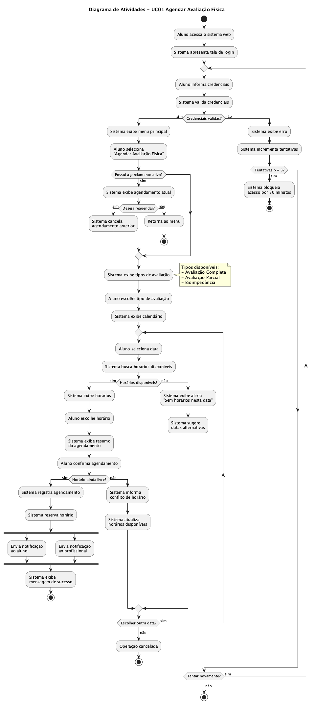

# Seção 3 – Diagrama de Atividades

## 3.1 Introdução

O diagrama de atividades apresenta o fluxo de trabalho do caso de uso **UC01 - Agendar Avaliação Física** do ator **Aluno**. Este diagrama ilustra a sequência de ações, pontos de decisão e tratamentos de exceção durante a execução do processo de agendamento.

O diagrama foi desenvolvido com base na especificação do caso de uso da Seção 2, mantendo correspondência com o fluxo principal, fluxos alternativos e fluxos de exceção.

---

## 3.2 UC01 - Agendar Avaliação Física

### Descrição

O diagrama representa o processo completo de agendamento de avaliação física pelo aluno através do módulo web. Estão contemplados:

- **Fluxo Principal:** Autenticação, seleção de tipo, escolha de data/horário, confirmação e notificações
- **Fluxo Alternativo:** Tratamento de agendamento existente, ausência de horários e conflitos
- **Fluxo de Exceção:** Falha de autenticação com bloqueio após tentativas

### Diagrama

---

## 3.3 Descrição do Fluxo

### Acesso ao Sistema

1. O aluno inicia o processo acessando o sistema via navegador ou aplicativo
2. O sistema apresenta a interface de autenticação

### Validação de Acesso

3. O aluno fornece suas credenciais (usuário e senha)
4. O sistema realiza a validação das credenciais
5. **Decisão:** Credenciais válidas permitem acesso ao menu
6. **Exceção:** Credenciais inválidas:
   - Incrementa contador de tentativas
   - Até 2 tentativas: permite nova tentativa
   - 3 ou mais tentativas: bloqueia acesso temporariamente

### Verificação de Agendamento Existente

7. O sistema verifica se o aluno já possui avaliação agendada
8. **Alternativo:** Se existir agendamento:
   - Exibe informações do agendamento atual
   - Oferece opção de reagendar ou manter
   - Se reagendar: cancela o anterior e prossegue

### Seleção do Tipo de Avaliação

9. O sistema apresenta os tipos de avaliação disponíveis
10. O aluno seleciona o tipo desejado (Completa, Parcial ou Bioimpedância)

### Escolha de Data e Horário

11. O sistema exibe o calendário com disponibilidade
12. O aluno seleciona a data pretendida
13. O sistema busca horários disponíveis para a data
14. **Decisão:** Se houver horários:
    - Exibe lista de horários
    - Aluno seleciona o horário
15. **Alternativo:** Se não houver horários:
    - Exibe alerta informando indisponibilidade
    - Sugere datas alternativas

### Confirmação e Registro

16. O sistema apresenta resumo do agendamento
17. O aluno confirma a solicitação
18. **Decisão:** Sistema verifica disponibilidade final
19. **Exceção:** Se ocorrer conflito (horário ocupado):
    - Informa o conflito
    - Atualiza lista de horários
    - Retorna para seleção

### Notificações Paralelas

20. Após registro bem-sucedido, o sistema dispara notificações em paralelo:
    - Notificação de confirmação ao aluno
    - Notificação ao profissional responsável

### Conclusão

21. O sistema exibe mensagem de sucesso
22. O processo é finalizado

---

## 3.4 Elementos Utilizados no Diagrama

| Elemento | Representação | Descrição |
|----------|---------------|-----------|
| **Início** | Círculo preenchido | Ponto inicial do fluxo |
| **Término** | Círculo com borda dupla | Ponto de encerramento do fluxo |
| **Atividade** | Retângulo arredondado | Ação realizada por ator ou sistema |
| **Decisão** | Losango | Ponto de ramificação com condições mutuamente exclusivas |
| **Fork** | Barra horizontal | Início de atividades paralelas |
| **Join** | Barra horizontal | Sincronização de atividades paralelas |
| **Repetição** | Estrutura repeat/while | Loop com condição de saída |
| **Nota** | Retângulo com dobra | Informação complementar |

---

## 3.5 Correspondência com a Especificação

| Elemento do Diagrama | Referência na Especificação |
|---------------------|----------------------------|
| Aluno acessa sistema web | FP - Passo 1 |
| Sistema apresenta login | FP - Passo 2 |
| Aluno informa credenciais | FP - Passo 3 |
| Sistema valida credenciais | FP - Passo 4 |
| Bloqueio após 3 tentativas | FE01 - Passos 4a.5 e 4a.6 |
| Verifica agendamento ativo | FA02 - Passo 5a.1 |
| Sistema exibe tipos | FP - Passo 6 |
| Aluno escolhe tipo | FP - Passo 7 |
| Sistema exibe calendário | FP - Passo 8 |
| Aluno seleciona data | FP - Passo 9 |
| Sem horários disponíveis | FA01 - Passos 10a.1 a 10a.3 |
| Sistema exibe horários | FP - Passo 10 |
| Aluno escolhe horário | FP - Passo 11 |
| Sistema exibe resumo | FP - Passo 12 |
| Aluno confirma | FP - Passo 13 |
| Conflito de horário | FE02 - Passos 14a.1 a 14a.4 |
| Sistema registra | FP - Passo 14 |
| Notificações paralelas | FP - Passos 15 e 16 |
| Mensagem de sucesso | FP - Passo 17 |

---

## 3.6 Observações sobre o Diagrama

1. **Nós de Decisão:** Todas as saídas dos losangos são mutuamente exclusivas ("sim"/"não"), eliminando ambiguidades no fluxo de controle.

2. **Verificação de Horário:** O sistema realiza dupla verificação de disponibilidade - ao exibir horários e ao confirmar - para evitar conflitos de concorrência.

3. **Fork e Join:** As notificações são disparadas em paralelo (fork) e sincronizadas antes da mensagem final (join implícito), garantindo que ambas sejam enviadas.

4. **Estruturas de Repetição:** Existem dois loops principais:
   - Loop de tentativas de login (máximo 3)
   - Loop de seleção de data/horário (até encontrar disponibilidade ou cancelar)

5. **Múltiplos Términos:** O diagrama possui vários pontos de saída representando diferentes resultados: sucesso no agendamento, cancelamento pelo usuário ou bloqueio de acesso.

6. **Fluxo Claro:** Em cada ponto de decisão, as condições e destinos estão claramente definidos, facilitando a compreensão do processo.
