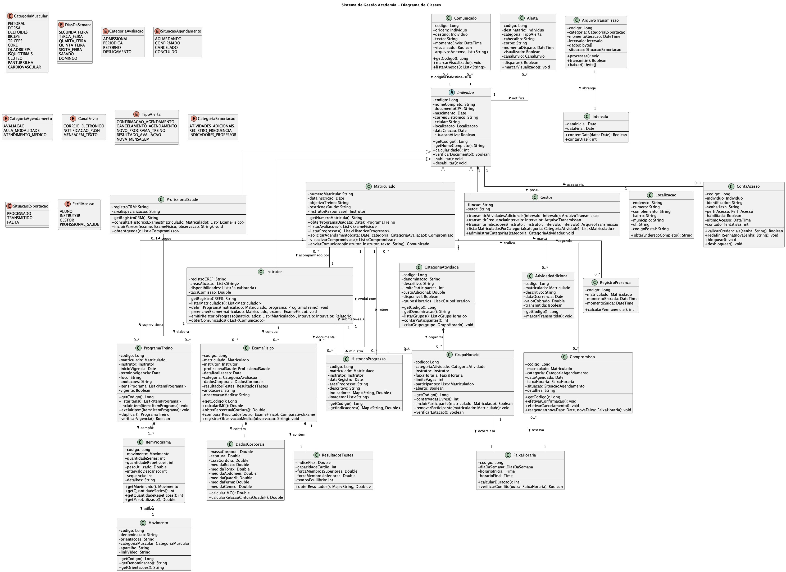

# Seção 4 – Diagrama de Classes

## 4.1 Introdução

O diagrama de classes apresenta a estrutura estática do Sistema de Gestão Academia, definindo as classes do domínio, seus atributos, operações e os relacionamentos entre elas. O modelo segue os princípios da orientação a objetos, aplicando conceitos de herança, composição, agregação e associação.

## 4.2 Visão Geral da Arquitetura

O sistema está estruturado nos seguintes módulos conceituais:

| Módulo | Descrição |
|--------|-----------|
| **Indivíduos** | Classes que representam os usuários do sistema (Matriculado, Instrutor, Gestor, ProfissionalSaude) |
| **Programa de Treino** | Classes relacionadas à gestão de programas e movimentos |
| **Avaliação** | Classes para exames físicos e acompanhamento de progresso |
| **Atividades** | Classes de categorias de atividades e grupos horários |
| **Agendamentos** | Classes de controle de compromissos |
| **Comunicação** | Classes de comunicados e alertas |
| **Integração** | Classes para transmissão de dados ao sistema financeiro |

## 4.3 Diagrama de Classes



## 4.4 Descrição das Classes

### 4.4.1 Hierarquia de Indivíduos

#### Individuo (Classe Abstrata)

Classe base que define atributos e comportamentos comuns a todas as pessoas no sistema.

| Atributo | Tipo | Descrição |
|----------|------|-----------|
| codigo | Long | Identificador único |
| nomeCompleto | String | Nome completo da pessoa |
| documentoCPF | String | Documento CPF |
| nascimento | Date | Data de nascimento |
| correioEletronico | String | Endereço de e-mail |
| celular | String | Número de celular |
| localizacao | Localizacao | Dados de endereço |
| dataCriacao | Date | Data de cadastro |
| situacaoAtiva | Boolean | Indica se está ativo |

| Operação | Retorno | Descrição |
|----------|---------|-----------|
| getCodigo() | Long | Obtém identificador |
| getNomeCompleto() | String | Obtém nome |
| calcularIdade() | int | Calcula idade atual |
| verificarDocumento() | Boolean | Valida CPF |
| habilitar() | void | Ativa cadastro |
| desabilitar() | void | Desativa cadastro |

---

#### Matriculado

Representa o aluno matriculado na academia. Especializa Individuo.

| Atributo | Tipo | Descrição |
|----------|------|-----------|
| numeroMatricula | String | Número único de matrícula |
| dataInscricao | Date | Data da matrícula |
| objetivoTreino | String | Objetivo (hipertrofia, emagrecimento, etc.) |
| restricoesSaude | String | Restrições médicas |
| instrutorResponsavel | Instrutor | Instrutor vinculado |

| Operação | Retorno | Descrição |
|----------|---------|-----------|
| obterProgramaDia(data) | ProgramaTreino | Retorna programa do dia |
| listarAvaliacoes() | List\<ExameFisico\> | Lista exames realizados |
| listarProgressos() | List\<HistoricoProgresso\> | Lista registros de progresso |
| solicitarAgendamento(data, categoria) | Compromisso | Solicita agendamento |
| visualizarCompromissos() | List\<Compromisso\> | Lista compromissos |
| enviarComunicado(instrutor, texto) | Comunicado | Envia mensagem |

---

#### Instrutor

Representa o professor/instrutor. Especializa Individuo.

| Atributo | Tipo | Descrição |
|----------|------|-----------|
| registroCREF | String | Registro profissional |
| areasAtuacao | List\<String\> | Áreas de especialização |
| disponibilidades | List\<FaixaHoraria\> | Horários disponíveis |
| taxaComissao | Double | Percentual de comissão |

| Operação | Retorno | Descrição |
|----------|---------|-----------|
| getRegistroCREF() | String | Obtém registro |
| listarMatriculados() | List\<Matriculado\> | Lista alunos vinculados |
| definirPrograma(matriculado, programa) | void | Define programa de treino |
| preencherExame(matriculado, exame) | void | Registra exame físico |
| emitirRelatorioProgresso(matriculados, intervalo) | Relatorio | Gera relatório |
| obterComunicados() | List\<Comunicado\> | Lista mensagens |

---

#### Gestor

Representa o administrador da academia. Especializa Individuo.

| Atributo | Tipo | Descrição |
|----------|------|-----------|
| funcao | String | Cargo ocupado |
| setor | String | Área de atuação |

| Operação | Retorno | Descrição |
|----------|---------|-----------|
| transmitirAtividadesAdicionais(intervalo) | ArquivoTransmissao | Exporta atividades |
| transmitirFrequencia(intervalo) | ArquivoTransmissao | Exporta frequência |
| transmitirIndicadores(instrutor, intervalo) | ArquivoTransmissao | Exporta métricas |
| listarMatriculadosPorCategoria(categoria) | List\<Matriculado\> | Lista por modalidade |
| administrarCategorias(categoria) | void | Gerencia modalidades |

---

#### ProfissionalSaude

Representa o médico responsável. Especializa Individuo.

| Atributo | Tipo | Descrição |
|----------|------|-----------|
| registroCRM | String | Registro no conselho |
| areaEspecializacao | String | Especialidade médica |

| Operação | Retorno | Descrição |
|----------|---------|-----------|
| getRegistroCRM() | String | Obtém registro |
| consultarHistoricoExames(matriculado) | List\<ExameFisico\> | Consulta histórico |
| incluirParecer(exame, observacao) | void | Adiciona parecer |
| obterAgenda() | List\<Compromisso\> | Lista compromissos |

---

### 4.4.2 Classes de Programa de Treino

#### ProgramaTreino

Representa o programa de treinamento do aluno.

| Atributo | Tipo | Descrição |
|----------|------|-----------|
| codigo | Long | Identificador |
| matriculado | Matriculado | Aluno do programa |
| instrutor | Instrutor | Instrutor responsável |
| inicioVigencia | Date | Início do período |
| terminoVigencia | Date | Fim do período |
| foco | String | Objetivo do programa |
| anotacoes | String | Observações |
| itensPrograma | List\<ItemPrograma\> | Itens do programa |
| vigente | Boolean | Status de vigência |

---

#### Movimento

Representa um exercício físico cadastrado.

| Atributo | Tipo | Descrição |
|----------|------|-----------|
| codigo | Long | Identificador |
| denominacao | String | Nome do exercício |
| orientacoes | String | Instruções de execução |
| categoriaMuscular | CategoriaMuscular | Grupo muscular |
| aparelho | String | Equipamento utilizado |
| linkVideo | String | Vídeo demonstrativo |

---

#### ItemPrograma

Representa um exercício dentro do programa com suas configurações.

| Atributo | Tipo | Descrição |
|----------|------|-----------|
| codigo | Long | Identificador |
| movimento | Movimento | Exercício referenciado |
| quantidadeSeries | int | Número de séries |
| quantidadeRepeticoes | int | Número de repetições |
| pesoUtilizado | Double | Carga em kg |
| intervaloDescanso | int | Descanso em segundos |
| sequencia | int | Ordem no programa |
| detalhes | String | Observações específicas |

---

### 4.4.3 Classes de Avaliação

#### ExameFisico

Representa uma avaliação física realizada.

| Atributo | Tipo | Descrição |
|----------|------|-----------|
| codigo | Long | Identificador |
| matriculado | Matriculado | Aluno avaliado |
| instrutor | Instrutor | Avaliador |
| profissionalSaude | ProfissionalSaude | Médico (opcional) |
| dataRealizacao | Date | Data do exame |
| categoria | CategoriaAvaliacao | Tipo de avaliação |
| dadosCorporais | DadosCorporais | Medidas do corpo |
| resultadosTestes | ResultadosTestes | Resultados de testes |
| anotacoes | String | Observações gerais |
| observacaoMedica | String | Parecer médico |

---

#### DadosCorporais

Agrupa as medidas corporais do exame.

| Atributo | Tipo | Descrição |
|----------|------|-----------|
| massaCorporal | Double | Peso em kg |
| estatura | Double | Altura em metros |
| taxaGordura | Double | Percentual de gordura |
| medidaBraco | Double | Circunferência braço |
| medidaTorax | Double | Circunferência tórax |
| medidaAbdomen | Double | Circunferência abdômen |
| medidaQuadril | Double | Circunferência quadril |
| medidaPerna | Double | Circunferência coxa |
| medidaGemeo | Double | Circunferência panturrilha |

---

#### ResultadosTestes

Agrupa os resultados dos testes físicos.

| Atributo | Tipo | Descrição |
|----------|------|-----------|
| indiceFlex | Double | Resultado flexibilidade |
| capacidadeCardio | int | Frequência cardíaca |
| forcaMembrosSuperiores | Double | Força MMSS |
| forcaMembrosInferiores | Double | Força MMII |
| tempoEquilibrio | int | Tempo em segundos |

---

### 4.4.4 Classes de Atividades

#### CategoriaAtividade

Representa uma modalidade oferecida.

| Atributo | Tipo | Descrição |
|----------|------|-----------|
| codigo | Long | Identificador |
| denominacao | String | Nome da modalidade |
| descritivo | String | Descrição |
| limiteParticipantes | int | Capacidade máxima |
| custoAdicional | Double | Valor extra |
| disponivel | Boolean | Se está ativa |
| gruposHorarios | List\<GrupoHorario\> | Turmas |

---

#### GrupoHorario

Representa uma turma de uma modalidade.

| Atributo | Tipo | Descrição |
|----------|------|-----------|
| codigo | Long | Identificador |
| categoriaAtividade | CategoriaAtividade | Modalidade |
| instrutor | Instrutor | Professor |
| faixaHoraria | FaixaHoraria | Horário |
| limiteVagas | int | Capacidade |
| participantes | List\<Matriculado\> | Alunos inscritos |
| aberto | Boolean | Se está aberto |

---

### 4.4.5 Classes de Agendamento

#### Compromisso

Representa um agendamento no sistema.

| Atributo | Tipo | Descrição |
|----------|------|-----------|
| codigo | Long | Identificador |
| matriculado | Matriculado | Aluno |
| categoria | CategoriaAgendamento | Tipo |
| dataAgendada | Date | Data marcada |
| faixaHoraria | FaixaHoraria | Horário |
| situacao | SituacaoAgendamento | Status |
| detalhes | String | Observações |

---

### 4.4.6 Classes de Comunicação

#### Comunicado

Representa uma mensagem entre usuários.

| Atributo | Tipo | Descrição |
|----------|------|-----------|
| codigo | Long | Identificador |
| origem | Individuo | Remetente |
| destino | Individuo | Destinatário |
| texto | String | Conteúdo |
| momentoEnvio | DateTime | Data/hora envio |
| visualizado | Boolean | Se foi lido |
| arquivosAnexos | List\<String\> | Anexos |

---

#### Alerta

Representa uma notificação do sistema.

| Atributo | Tipo | Descrição |
|----------|------|-----------|
| codigo | Long | Identificador |
| destinatario | Individuo | Quem recebe |
| categoria | TipoAlerta | Tipo do alerta |
| cabecalho | String | Título |
| corpo | String | Mensagem |
| momentoDisparo | DateTime | Data/hora |
| visualizado | Boolean | Se foi visto |
| canalEnvio | CanalEnvio | Canal utilizado |

---

### 4.4.7 Classes de Integração

#### ArquivoTransmissao

Representa arquivo de exportação para sistema financeiro.

| Atributo | Tipo | Descrição |
|----------|------|-----------|
| codigo | Long | Identificador |
| categoria | CategoriaExportacao | Tipo |
| momentoGeracao | DateTime | Data geração |
| intervalo | Intervalo | Período |
| dados | byte[] | Conteúdo |
| situacao | SituacaoExportacao | Status |

---

## 4.5 Enumerações

### CategoriaMuscular
```
PEITORAL, DORSAL, DELTOIDES, BICEPS, TRICEPS, CORE,
QUADRICEPS, ISQUIOTIBIAIS, GLUTEO, PANTURRILHA, CARDIOVASCULAR
```

### DiasDaSemana
```
SEGUNDA_FEIRA, TERCA_FEIRA, QUARTA_FEIRA, QUINTA_FEIRA,
SEXTA_FEIRA, SABADO, DOMINGO
```

### CategoriaAvaliacao
```
ADMISSIONAL, PERIODICA, RETORNO, DESLIGAMENTO
```

### SituacaoAgendamento
```
AGUARDANDO, CONFIRMADO, CANCELADO, CONCLUIDO
```

### CategoriaAgendamento
```
AVALIACAO, AULA_MODALIDADE, ATENDIMENTO_MEDICO
```

### CanalEnvio
```
CORREIO_ELETRONICO, NOTIFICACAO_PUSH, MENSAGEM_TEXTO
```

### TipoAlerta
```
CONFIRMACAO_AGENDAMENTO, CANCELAMENTO_AGENDAMENTO,
NOVO_PROGRAMA_TREINO, RESULTADO_AVALIACAO, NOVA_MENSAGEM
```

### PerfilAcesso
```
ALUNO, INSTRUTOR, GESTOR, PROFISSIONAL_SAUDE
```

---

## 4.6 Relacionamentos

### 4.6.1 Generalização (Herança)

| Superclasse | Subclasses |
|-------------|------------|
| Individuo | Matriculado, Instrutor, Gestor, ProfissionalSaude |

### 4.6.2 Composição

| Classe Composta | Componente | Descrição |
|-----------------|------------|-----------|
| Individuo | Localizacao | Indivíduo possui localização |
| ExameFisico | DadosCorporais | Exame contém dados corporais |
| ExameFisico | ResultadosTestes | Exame contém resultados |
| ProgramaTreino | ItemPrograma | Programa compõe itens |
| CategoriaAtividade | GrupoHorario | Categoria organiza grupos |

### 4.6.3 Agregação

| Classe Agregadora | Agregado | Descrição |
|-------------------|----------|-----------|
| ItemPrograma | Movimento | Item utiliza movimento |
| GrupoHorario | Matriculado | Grupo reúne matriculados |

### 4.6.4 Associações Principais

| Origem | Destino | Cardinalidade | Descrição |
|--------|---------|---------------|-----------|
| Matriculado | Instrutor | N:1 | Acompanhamento |
| Matriculado | ProgramaTreino | 1:N | Possui programas |
| Instrutor | ProgramaTreino | 1:N | Elabora programas |
| Matriculado | ExameFisico | 1:N | Realiza exames |
| Matriculado | Compromisso | 1:N | Agenda compromissos |
| Individuo | ContaAcesso | 1:0..1 | Acessa sistema |
